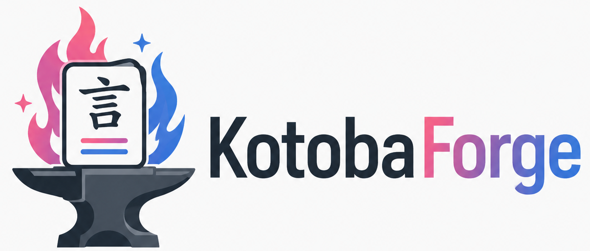

**KotobaForge** is an open-source, entirely vibe-coded vocabulary learning application for people who want a stricter, more structured way to study Japanese words and phrases. It is heavily inspired by the lesson-and-review rhythm of WaniKani, but instead of teaching a fixed kanji curriculum, KotobaForge is built around the vocabulary that *you* choose to study.

The idea is simple: add words and phrases from your own life, organize them by source, and review them through a strict spaced repetition system that does not let you casually mark answers correct. Whether the word came from work, a manga, a visual novel, an anime, a book, or a conversation, KotobaForge is designed to turn those personally encountered words into a focused study queue.

I began working on this project after talking with a friend about the feasibility of creating functional apps using only vibe-coding (thanks, Hunter!). He referred me to [this podcast](https://www.news.aakashg.com/p/claude-code-dev-team) that sort of outlines how one would even do something like this. While this was my first attempt at vibe-coding anything, I still have no way of telling how this stacks up against professionally-written, production-grade code (despite working in a field that involves software development), but it seems better than anything I've personally written in a non-vibe coding environment at this scale (i.e., [Simulator 2](https://dx.doi.org/10.2139/ssrn.7022098)). How frightening.

## Quick Start (Windows)

Prerequisites: [Python 3.12+](https://www.python.org/downloads/) and [Node.js LTS](https://nodejs.org/) on your `PATH`.

1. Double-click `start_kotobaforge.bat` (or run it from a terminal). The first run sets up a Python virtual environment and installs frontend dependencies, so it takes a minute; every run after that is fast.
2. A "KotobaForge Server" console window opens, and your browser opens to `http://127.0.0.1:8000` once the server is ready.
3. Drop your `.xlsx` word-bank files into the `wordbanks/` folder at the project root, then click **Refresh Word Banks** on the Admin page to import them.
4. To stop KotobaForge, close the "KotobaForge Server" window.

Your data lives in `backend/data/kotobaforge.db` and is never touched by the word-bank files themselves — re-running the importer never resets your progress.

## Word-Bank File Format

Each `.xlsx` file in `wordbanks/` is one source (its filename becomes the source key, and the display name can be edited in the app). Every file needs a sheet named `items` with these columns:

| Column | Required | Notes |
|---|---|---|
| `item_type` | Yes | `word` or `phrase` |
| `japanese` | Yes | Main display form (kanji or kana) |
| `kana` | Yes | Kana reading; same as `japanese` for kana-only items |
| `romaji` | Yes | Lesson display only, never accepted as a review answer |
| `meanings` | Yes | Semicolon-separated English meanings, e.g. `confirm; verify; check` |
| `part_of_speech` | Yes | noun, verb, adjective, expression, etc. |
| `example_japanese` / `example_kana` / `example_english` | No | Semicolon-separated, paired by position across all three columns |
| `similar_items` | No | Semicolon-separated related words/phrases, shown as plain text |
| `source_note` | No | Free-text note about this item's use in this source |

Progress, SRS state, notes, mnemonics, and synonyms are stored only in the SQLite database, never written back to the Excel files, so you're always free to keep editing your word banks.

## Why I Built This

I (or rather Claude) built KotobaForge because I wanted a better way to learn Japanese vocabulary from the things I actually encounter.

I have used Anki, and while it is powerful, I always found its self-grading system a little too lenient for the way I study. When a flashcard appears and I am the one deciding whether I “basically got it right,” it becomes way too easy to cheat myself. I wanted something stricter. Something that forces me to type the answer, checks it automatically, and makes me earn progress through repeated correct reviews.

At the same time, I really loved WaniKani’s structure. The clean lesson flow, the scheduled reviews, the feeling of items moving from Apprentice to Guru to Master and beyond — all of that made studying feel organized and motivating. But WaniKani teaches its own curated set of kanji and vocabulary. I wanted that same style of learning, but for words that matter to me personally: words from Japanese coworkers, games I am playing, manga I am reading, and phrases I keep seeing in the wild.

KotobaForge is my attempt to combine those ideas: the strictness and structure of WaniKani with a personalized vocabulary bank built from real encounters.

## What KotobaForge Does

KotobaForge lets you maintain local Excel-based word banks and study them through a WaniKani-like lesson and review system.

Each vocabulary item can include:

* Japanese written form
* Kana reading
* Romaji reference
* English meanings
* Part of speech
* Example sentences
* Example sentence translations
* Source information
* User notes
* Mnemonics
* Accepted synonyms
* Similar words or phrases

The app supports both **words** and **phrases**, but it is intentionally focused on vocabulary rather than full grammar study or sentence mining.

## How It Works

KotobaForge is built around source-based learning. Instead of one giant mixed deck, vocabulary is organized by where it came from.

For example:

```text
wordbanks/
  work.xlsx
  fate_stay_night.xlsx
  manga.xlsx
  visual_novel.xlsx
```

Each Excel file represents a vocabulary source. When the app starts, it scans the configured word-bank folder, validates the files, imports new items, and updates the local database without resetting existing progress.

Progress is stored separately from the source files, so you can keep editing and expanding your word banks while preserving your review history.

## Lessons

Lessons introduce new words and phrases in small batches. By default, KotobaForge presents five new items at a time.

During a lesson, the app shows the item’s written form, kana reading, romaji, meanings, part of speech, examples, translations, notes, and mnemonics. After learning the batch, the user must pass an initial quiz before the items enter the review system.

Lesson quizzes ask both directions:

* Japanese → English meaning
* English meaning → Japanese word or phrase

The item is only considered passed if both sides are answered correctly.

## Reviews

Reviews are strict and typed. There is no “I got it right” button and no manual self-grading during reviews.

For each item, KotobaForge asks for both:

* The English meaning
* The Japanese answer, typed in kana or kanji

Romaji is not accepted as a Japanese answer. English is only accepted for meaning prompts.

An item only advances if both review prompts are answered correctly. If either side is wrong, the item is treated as incorrect and its SRS progress is adjusted accordingly.

## SRS Progression

KotobaForge uses a WaniKani-inspired SRS ladder:

```text
Apprentice
Guru
Master
Enlightened
Burned
```

Items move through scheduled review stages over time. Correct answers advance the item, while incorrect answers lower its progress. Burned items are considered learned and leave the normal review queue.

The goal is to make vocabulary study feel earned, not self-reported.

## Source-Based Levels

KotobaForge uses source-specific levels rather than one global level.

For example:

```text
Work Level 1
Work Level 2
Fate/Stay Night Level 1
Fate/Stay Night Level 2
```

Each source has its own level progression. A source level contains a batch of vocabulary items, and the next level unlocks once enough items in the current level have reached Guru status.

If the same word appears in multiple sources, KotobaForge can merge the entries while preserving shared progress. This means that if you learn a word from work and later encounter it in a visual novel, your existing progress carries over.

## Local-First Design

KotobaForge is designed to run locally first.

The initial version does not require accounts, cloud sync, external AI services, audio APIs, internet lookups, or hosted infrastructure. It is meant to be a personal study tool that runs from your own machine in a local browser window.

The planned V1 stack is:

```text
Frontend: React + Vite
Backend: Python FastAPI
Database: SQLite
Word-bank format: Excel .xlsx
Runtime: Local browser app
```

This local-first design keeps the project simple while leaving room for a future web-based version with accounts and sync.

## Project Goals

KotobaForge aims to be:

* Strict enough to prevent lazy self-grading
* Flexible enough to study personally chosen vocabulary
* Structured enough to feel like WaniKani
* Local enough to work without external services
* Simple enough to vibe-code and iterate on
* Open enough for future expansion

## Development Setup

Use this instead of the packaged launcher when you're changing code — it runs the backend and frontend as separate dev servers with hot reload.

### Backend

```bash
cd backend
python -m venv .venv
.venv\Scripts\activate      # Windows
pip install -r requirements.txt
python -m uvicorn app.main:app --reload --port 8000
```

Health check: `http://localhost:8000/api/health`

Run tests:

```bash
cd backend
python -m pytest
```

### Frontend

```bash
cd frontend
npm install
npm run dev
```

Open `http://localhost:5173`. The dev server proxies `/api` requests to the backend on port 8000, so run both at the same time.

Build for production (this is also what `start_kotobaforge.bat` runs automatically):

```bash
cd frontend
npm run build
```

## Current Vision

KotobaForge is not meant to replace dictionaries, grammar guides, or full Japanese learning platforms. It is a focused tool for one specific job:

**Turn Japanese words and phrases you personally encounter into a strict, structured, WaniKani-like study system.**

The long-term goal is to make vocabulary study feel less like managing a pile of flashcards and more like progressing through a personalized learning path built from the Japanese you actually care about.
